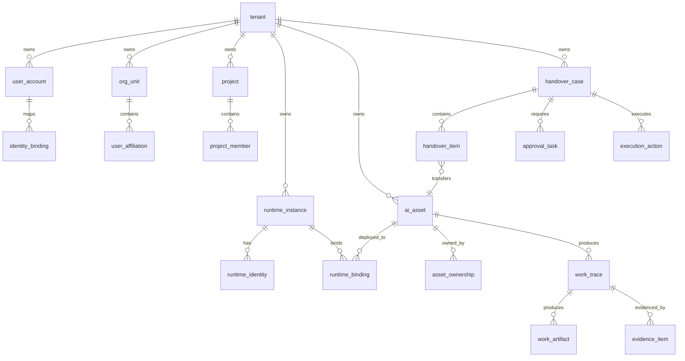
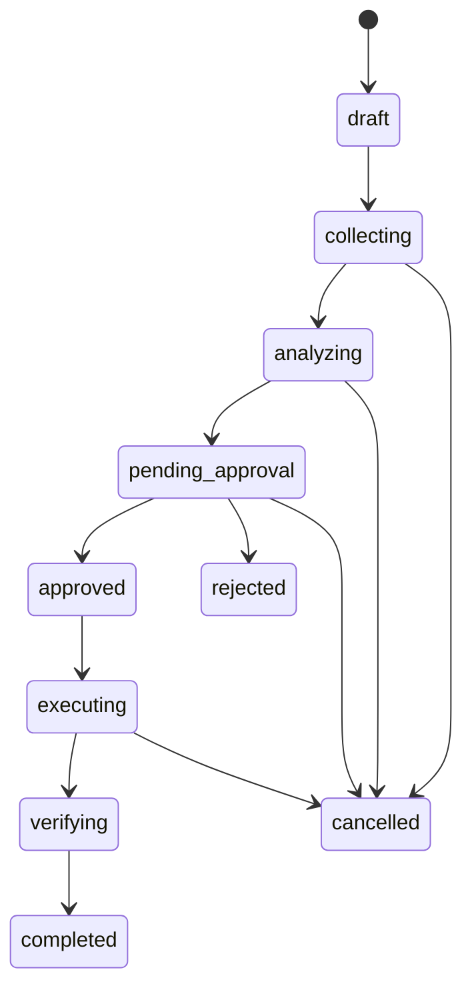

# 03. MySQL 数据模型

## 1. 建模原则

- MySQL 8.0 作为唯一主业务数据库。
- 所有表使用 `utf8mb4`、`InnoDB`。
- 主键使用 UUID 字符串或 ULID，推荐 `char(26)` ULID，便于排序和分库。
- 所有核心业务表包含 `tenant_id`、`created_at`、`updated_at`。
- 审计和证据只追加，不物理删除。
- 大文件、备份包、产物放 MinIO/S3，MySQL 只存元数据、哈希和对象路径。
- JSON 字段仅用于扩展属性，不替代核心关系字段。

## 2. 核心数据域



## 3. 关键表

### 3.1 租户与组织

#### `tenant`

| 字段 | 类型 | 说明 |
|---|---|---|
| id | char(26) pk | 租户 ID |
| name | varchar(128) | 企业或客户名称 |
| code | varchar(64) unique | 租户编码 |
| status | enum | active, suspended, archived |
| settings_json | json | 租户配置 |

#### `user_account`

| 字段 | 类型 | 说明 |
|---|---|---|
| id | char(26) pk | 用户 ID |
| tenant_id | char(26) index | 租户 |
| email | varchar(255) | 邮箱 |
| display_name | varchar(128) | 显示名 |
| employment_status | enum | active, leaving, departed, contractor, disabled |
| manager_user_id | char(26) null | 直属主管 |
| last_active_at | datetime null | 最后活跃 |

#### `identity_binding`

用于把同一员工在不同平台的身份统一起来。

| 字段 | 类型 | 说明 |
|---|---|---|
| id | char(26) pk | 绑定 ID |
| tenant_id | char(26) index | 租户 |
| user_id | char(26) index | DuckDock 用户 |
| provider | enum | openclaw, arkclaw, workbuddy, jvs, oidc, ldap |
| external_user_id | varchar(255) | 外部平台用户 ID |
| external_username | varchar(255) | 外部用户名 |
| confidence | decimal(5,4) | 匹配置信度 |
| verified_at | datetime null | 人工确认时间 |

### 3.2 运行时与连接

#### `runtime_instance`

| 字段 | 类型 | 说明 |
|---|---|---|
| id | char(26) pk | 运行时实例 ID |
| tenant_id | char(26) index | 租户 |
| provider | enum | openclaw, arkclaw, workbuddy, jvs, custom |
| name | varchar(128) | 实例名称 |
| base_url | varchar(512) | API 或控制台地址 |
| deploy_type | enum | saas, private, on_prem, offline |
| status | enum | active, degraded, disabled |
| credential_ref | varchar(255) | Vault/KMS 凭证引用 |
| last_sync_at | datetime null | 最后同步时间 |

#### `collection_job`

| 字段 | 类型 | 说明 |
|---|---|---|
| id | char(26) pk | 采集任务 |
| tenant_id | char(26) index | 租户 |
| runtime_id | char(26) index | 运行时 |
| trigger_type | enum | manual, scheduled, offboarding, project_handover, webhook |
| scope_json | json | 采集范围 |
| status | enum | pending, running, succeeded, failed, cancelled |
| started_at | datetime null | 开始时间 |
| finished_at | datetime null | 结束时间 |
| summary_json | json | 统计摘要 |
| error_message | text null | 错误 |

### 3.3 AI 资产

#### `ai_asset`

| 字段 | 类型 | 说明 |
|---|---|---|
| id | char(26) pk | 资产 ID |
| tenant_id | char(26) index | 租户 |
| asset_type | enum | skill, agent, prompt, workflow, mcp, tool, knowledge_base, scheduled_task, credential_ref, workspace, other |
| name | varchar(255) | 资产名称 |
| description | text null | 描述 |
| source_provider | enum | duckdock, openclaw, arkclaw, workbuddy, jvs, custom |
| source_runtime_id | char(26) null | 来源运行时 |
| external_id | varchar(255) null | 外部 ID |
| status | enum | active, inactive, archived, orphaned, risky, transferred |
| criticality | enum | low, medium, high, critical |
| metadata_json | json | 平台扩展信息 |
| content_hash | char(64) null | 内容哈希 |
| first_seen_at | datetime | 首次发现 |
| last_seen_at | datetime | 最后发现 |

唯一约束：

- `(tenant_id, source_provider, source_runtime_id, external_id)`

#### `asset_ownership`

| 字段 | 类型 | 说明 |
|---|---|---|
| id | char(26) pk | 归属记录 |
| tenant_id | char(26) index | 租户 |
| asset_id | char(26) index | 资产 |
| owner_type | enum | creator, maintainer, business_owner, steward, receiver |
| user_id | char(26) null | 个人 |
| org_unit_id | char(26) null | 部门 |
| project_id | char(26) null | 项目 |
| confidence | decimal(5,4) | 置信度 |
| evidence_id | char(26) null | 证据 |
| is_primary | bool | 是否主负责人 |

#### `runtime_binding`

| 字段 | 类型 | 说明 |
|---|---|---|
| id | char(26) pk | 绑定 ID |
| tenant_id | char(26) index | 租户 |
| asset_id | char(26) index | 资产 |
| runtime_id | char(26) index | 运行时 |
| external_ref | varchar(255) | 平台引用 |
| environment | enum | dev, test, staging, prod, unknown |
| usage_status | enum | active, idle, failed, retired |
| last_used_at | datetime null | 最近使用 |

### 3.4 工作历程

#### `work_trace`

| 字段 | 类型 | 说明 |
|---|---|---|
| id | char(26) pk | 工作历程 ID |
| tenant_id | char(26) index | 租户 |
| runtime_id | char(26) index | 运行时 |
| asset_id | char(26) null index | 相关资产 |
| external_session_id | varchar(255) null | 外部会话 ID |
| actor_user_id | char(26) null | 发起人 |
| title | varchar(255) | 标题 |
| summary | text null | 摘要 |
| trace_type | enum | session, task_run, automation_run, file_change, approval, deployment |
| started_at | datetime null | 开始 |
| ended_at | datetime null | 结束 |
| sensitivity | enum | public, internal, confidential, restricted |
| metadata_json | json | 扩展 |

#### `work_artifact`

| 字段 | 类型 | 说明 |
|---|---|---|
| id | char(26) pk | 产物 ID |
| tenant_id | char(26) index | 租户 |
| trace_id | char(26) index | 工作历程 |
| asset_id | char(26) null | 关联资产 |
| artifact_type | enum | file, transcript, diff, report, package, screenshot, log |
| name | varchar(255) | 名称 |
| object_uri | varchar(1024) | MinIO/S3 路径 |
| sha256 | char(64) | 哈希 |
| size_bytes | bigint | 大小 |
| sensitivity | enum | public, internal, confidential, restricted |

### 3.5 证据链

#### `evidence_item`

| 字段 | 类型 | 说明 |
|---|---|---|
| id | char(26) pk | 证据 ID |
| tenant_id | char(26) index | 租户 |
| source_type | enum | api, backup_package, browser_snapshot, audit_log, user_confirm, llm_analysis |
| source_provider | enum | openclaw, arkclaw, workbuddy, jvs, duckdock, custom |
| collection_job_id | char(26) null | 采集任务 |
| object_uri | varchar(1024) null | 原始证据对象 |
| sha256 | char(64) null | 证据哈希 |
| summary | text | 证据摘要 |
| confidence | decimal(5,4) | 置信度 |
| visibility | enum | normal, sensitive, restricted |
| created_by | char(26) null | 创建人 |

### 3.6 交接

#### `handover_case`

| 字段 | 类型 | 说明 |
|---|---|---|
| id | char(26) pk | 交接单 |
| tenant_id | char(26) index | 租户 |
| case_type | enum | employee_offboarding, project_handover, vendor_exit, incident_takeover |
| title | varchar(255) | 标题 |
| subject_user_id | char(26) null | 离职员工 |
| project_id | char(26) null | 项目 |
| receiver_user_id | char(26) null | 默认接收人 |
| status | enum | draft, collecting, analyzing, pending_approval, approved, executing, verifying, completed, rejected, cancelled |
| risk_level | enum | low, medium, high, critical |
| due_at | datetime null | 截止时间 |
| summary_json | json | 统计摘要 |

#### `handover_item`

| 字段 | 类型 | 说明 |
|---|---|---|
| id | char(26) pk | 交接项 |
| tenant_id | char(26) index | 租户 |
| handover_case_id | char(26) index | 交接单 |
| asset_id | char(26) index | 资产 |
| recommended_action | enum | transfer_owner, archive, disable, rotate_secret, export_package, manual_review, ignore |
| receiver_user_id | char(26) null | 接收人 |
| risk_reason | text null | 风险原因 |
| evidence_id | char(26) null | 证据 |
| status | enum | proposed, approved, executing, done, failed, skipped |

#### `approval_task`

| 字段 | 类型 | 说明 |
|---|---|---|
| id | char(26) pk | 审批任务 |
| tenant_id | char(26) index | 租户 |
| handover_case_id | char(26) index | 交接单 |
| approver_user_id | char(26) | 审批人 |
| approval_type | enum | manager, receiver, security, platform_admin |
| status | enum | pending, approved, rejected, delegated |
| comment | text null | 意见 |
| decided_at | datetime null | 审批时间 |

#### `execution_action`

| 字段 | 类型 | 说明 |
|---|---|---|
| id | char(26) pk | 执行动作 |
| tenant_id | char(26) index | 租户 |
| handover_case_id | char(26) index | 交接单 |
| handover_item_id | char(26) null | 交接项 |
| action_type | enum | sync_asset, create_backup, transfer_owner, revoke_permission, rotate_secret, archive_asset, disable_task, export_package |
| provider | enum | duckdock, openclaw, arkclaw, workbuddy, jvs, custom |
| status | enum | pending, running, succeeded, failed, requires_manual |
| request_json | json | 请求参数 |
| result_json | json | 执行结果 |
| idempotency_key | varchar(128) | 幂等键 |

## 4. 状态机

### 4.1 交接单状态



### 4.2 资产状态

```text
active -> risky -> transferred -> active
active -> orphaned -> transferred
active -> archived
active -> inactive
```

## 5. MySQL 迁移注意事项

当前项目若已有 PostgreSQL 迁移，需要新增 MySQL 迁移计划：

- 将 PostgreSQL enum 替换为 MySQL enum 或 varchar + check 约束。
- 将 `pg_advisory_xact_lock` 替换为 MySQL `GET_LOCK()` 或业务表行级锁。
- 将 `jsonb` 替换为 MySQL `json`。
- 将 `ILIKE` 替换为 MySQL collation 或全文索引。
- 将 pgvector 相关能力迁移到 OpenSearch/Qdrant。
- Alembic 生成迁移时必须在 MySQL 8.0 实例上验证。

## 6. 索引要求

MVP 必须建立：

- `ai_asset(tenant_id, asset_type, status)`
- `ai_asset(tenant_id, source_provider, source_runtime_id, external_id)`
- `asset_ownership(tenant_id, user_id, owner_type)`
- `runtime_binding(tenant_id, runtime_id, usage_status)`
- `work_trace(tenant_id, actor_user_id, started_at)`
- `work_trace(tenant_id, asset_id, started_at)`
- `handover_case(tenant_id, status, case_type)`
- `handover_item(tenant_id, handover_case_id, status)`
- `evidence_item(tenant_id, collection_job_id)`
- `audit_log(tenant_id, actor_user_id, created_at)`

