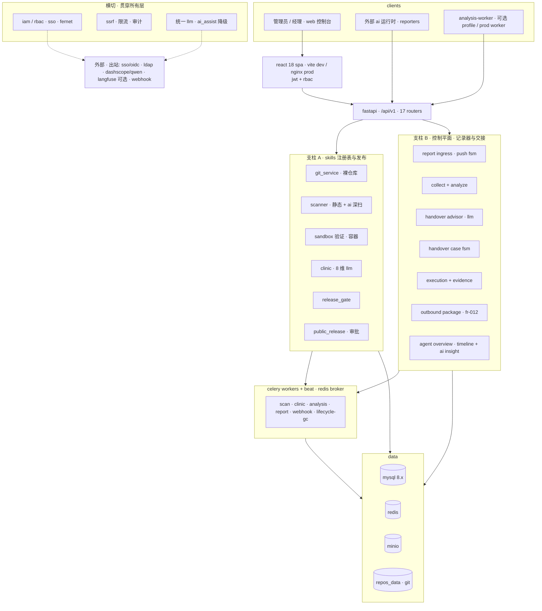
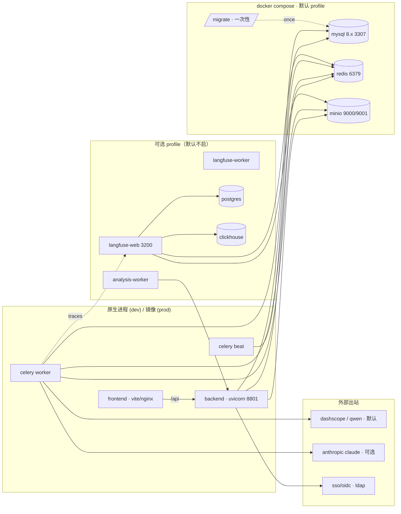
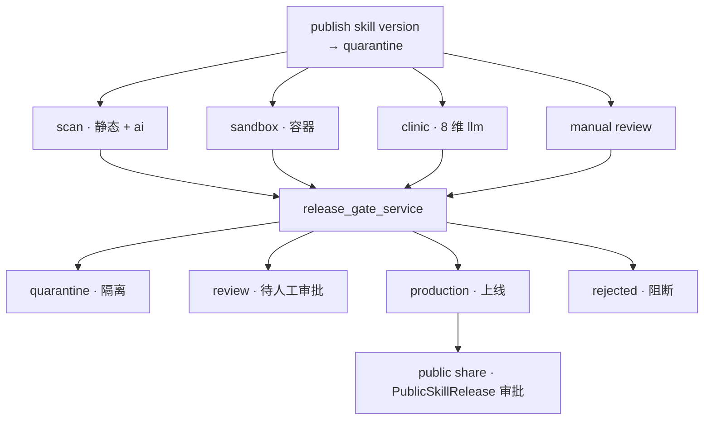
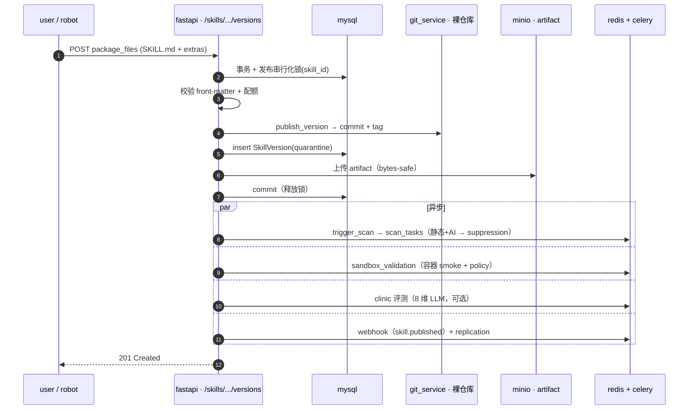
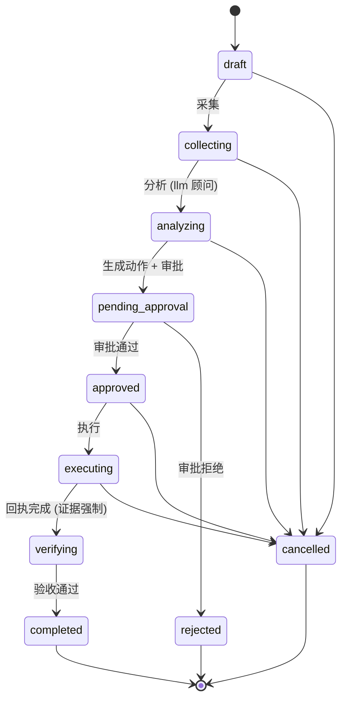
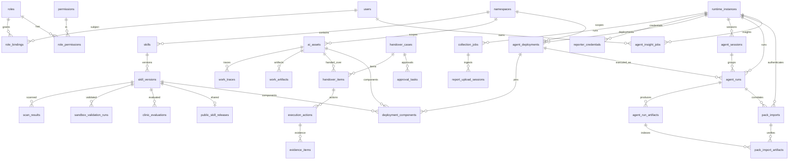
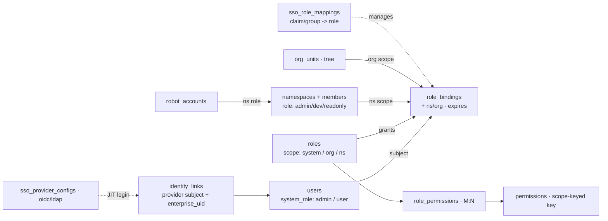

# DuckDock 业务架构总览

> 最后更新: 2026-07-09 · 双支柱（Skills 注册表 + Reporter/Worker 控制平面与交接）· L0–L4 + 006 收敛后
> 中文导航另见 README §4；本文是单一权威架构说明，随代码演进维护。

## 1. 定位与终态

DuckDock = **企业 AI Agent 资产与交接控制平面**，两条支柱：

- **支柱 A · Skills 注册表与发布**（ClawDock/ClawHub）：私有 skill 注册表 + 发布门禁（Scanner + Sandbox + Clinic + ReleaseGate）+ 审批门控的公开分发。Git bare repo 存版本，MinIO 分发 artifact。
- **支柱 B · 控制平面 · 记录器与交接**：盘点 AI 资产/工作痕迹（recorder），驱动离职/项目**交接闭环**（资产 → 建议 → 审批 → 执行 → 证据回执 → 验收 → 对外交接包）。

**终态 = 受治理的记录器 + AI 辅助**：记录 + LLM 出建议，执行始终是**人工动作 + 留痕**，不做自治控制面。真实数据入口只有一个：外部运行时的 **Push 自报**。单租户自托管（一企业一实例），强调审计可追溯、凭证安全、最小暴露、LLM 仅建议。

---

## 2. 默认端口方案

| 服务 | Host 端口 | 容器端口 | 对外? |
|---|---|---|---|
| Frontend (Vite dev / nginx prod) | **5174** / **80** | 5174 / 80 | 浏览器 |
| Backend (FastAPI) | **8801** | 8801 | 浏览器 / CLI |
| MySQL 8.x | **3307** | 3306 | 仅本机 · 主业务库 |
| PostgreSQL | 5432 | 5432 | 仅本机 · observability profile（Langfuse）|
| Redis | **6379** | 6379 | 仅本机（celery broker, 限流）|
| MinIO S3 API / Console | **9000** / **9001** | 9000 / 9001 | 本机 + 签名 URL |
| Langfuse Web | **3200** | 3000 | 浏览器 · observability profile |
| ClickHouse | — | 8123 | 仅内网 · observability profile |

端口在 `docker-compose.yml` 顶部集中记录；发生冲突时只调整 host 侧映射。

---

## 3. 系统分层架构



**请求主干**：浏览器/运行时 → React SPA（dev 走 Vite `:5174` 代理 `/api`→后端 `:8801`；prod 走 nginx 托管 SPA + 反代 `/api`）→ FastAPI `/api/v1`（JWT + RBAC，18 个 router）→ 两支柱领域服务 → Celery 异步 + MySQL/Redis/MinIO/git 数据层。横切层（IAM/安全/统一 LLM）与外部出站依赖贯穿其中。

---

## 4. 容器拓扑



默认 dev `docker compose up` 只起 `mysql · redis · minio · backend · worker · beat · frontend`；prod 默认多一次性 `migrate` 和 `minio-init`。`analysis-worker`、`observability`（Langfuse + Postgres + ClickHouse）、`telemetry`（debug Collector）与 `telemetry-langfuse`（带 file-storage WAL 的 provider exporter）均为可选 profile。

---

## 5. 支柱 A · 发布门禁

一个 skill version 从 `quarantine` 起，过四道检查汇入 `release_gate_service` 定状态；只有 `production` 能进入审批门控的对外分享。



`SkillVersionStatus = quarantine · scanning · review · production · rejected`；`ScanStatus = pending · running · passed · warned · failed`（critical/high → version `rejected`）。

一次 `skill publish` 请求链（同一 skill 的并发发布在事务内串行化，保证 tag 唯一 / artifact 上传 / 配额计数不撕裂）：



---

## 6. 支柱 B · 控制平面 · 记录器与交接

**记录器入口**：外部运行时（reporters）经 **Push 自报**，服务端不主动连厂商平台。006 后拆成两条链路：

- **日常结构化报告**：日报/周报由 Reporter 提交 `duckdock-structured-report-v1` JSON 到 `POST /api/v1/reports/structured`，后端同步校验 schema、幂等键和 credential scope，直接物化 `CollectionJob` / `WorkTrace` / `AIAsset` / `MemoryCandidate`，不创建上传会话，不排 analysis-worker。
- **交接/审计包**：需要证据、文件、hash 或复杂归档时，Reporter 上传 `duckdock-pack-v1.zip` → `report_upload_sessions` FSM（`pending → uploaded → verifying → ingesting → succeeded/failed/expired`）→ Analysis Worker 产出 `duckdock-analysis-v1` 标准结果 → 校验后物化 `work_traces` / `work_artifacts` / `ai_assets`。该 worker 可按积压队列多副本扩容。

**管理员概览**：`/control-plane/runtimes/:runtimeId/overview?user_id=...` 聚合结构化日报/周报、交接包、资产、工作痕迹和候选信号，形成员工/agent 长线时间轴。“生成 AI 概览”创建 `agent_insight_jobs`，由 Celery `run_agent_insight_job` 使用 `DUCKDOCK_LLM_*` 的 OpenAI-compatible 连接读取结构化快照并返回标准 JSON；配置缺失或模型失败时保守生成 baseline 结果，UI 用 `ai_assist` 明示降级。

**006 后的接入口径**：员工/Agent 侧 Reporter 先用登录态调 `POST /api/v1/reporters/enroll` 自助登记 runtime endpoint，拿一次性显示的长期可撤销 **Reporter Credential**（`dkr_report_*`）；运行期间用 `POST /api/v1/reporters/heartbeat` 保持在线可见。日常上报使用 `report.structured` scope，交接/审计包再用 `report.upload` scope 创建短期 upload session 并拿 presigned PUT URL 直传 MinIO。管理员手工创建的 runtime report token 仍保留为兼容/运维兜底，不再是推荐产品路径。

**交接闭环 FSM**（`HandoverCase`）：`executing → verifying` 一步**强制证据回执**——敏感/高危资产标 `succeeded` 前必须附 `evidence_id`。



证据规则（锁定决策）：`ExecutionAction` 标 `succeeded` 前，当资产 `Criticality ∈ {high, critical}` **或** 关联 `WorkTrace.sensitivity ≥ INTERNAL`（默认即 INTERNAL）时必须附证据，否则 `422`。完成的 case 可产出脱敏后的对外交接包：zip 写入 MinIO，并通过限时签名 URL 下载。公开执行请求当前只接受 `manual`；数据库枚举中的 `auto` 仅为历史记录兼容保留。

---

## 7. 数据模型概览

业务表按领域拆分，准确数量与迁移头以当前代码中的 Alembic metadata、`alembic heads` 和 `alembic current` 为准，不在文档中固化易漂移的计数。`users`（actor/owner）与 `namespaces`（作用域）是两个主要枢纽。核心实体与关系：



七个域聚类：

| 域 | 关键表 |
|---|---|
| identity & access | `users` · `identity_links` · `org_units` · `roles` · `role_permissions` · `permissions` · `role_bindings` · `sso_provider_configs` · `sso_role_mappings` · `robot_accounts` · `user_affiliations` |
| registry & release | `namespaces` · `namespace_members` · `skills` · `skill_versions` · `scan_results` · `sandbox_validation_runs` · `public_skill_releases` · `namespace_governance_policies` |
| assets & traces | `ai_assets` · `asset_ownerships` · `work_traces` · `work_artifacts` · `provider_principals` · `memory_candidates` |
| runtime & collection | `runtime_instances` · `runtime_bindings` · `agent_deployments` · `deployment_components` · `agent_sessions` · `agent_runs` · `agent_run_artifacts` · `telemetry_sinks` · `trace_backend_refs` · `generic_trace_projections` · `pack_imports` · `pack_import_artifacts` · `collection_jobs` · `raw_collection_records` · `report_upload_sessions` · `reporter_credentials` · `analysis_workers` · `analysis_result_artifacts` · `agent_insight_jobs` |
| handover | `handover_cases` · `handover_items` · `approval_tasks` · `execution_actions` · `evidence_items` · `user_handover_profiles` |
| evaluation & flywheel | `evaluation_datasets` · `evaluation_dataset_versions` · `evaluation_dataset_curation_batches` · `evaluation_sampling_policies` · `evaluation_sampling_policy_versions` · `evaluation_sampling_runs` · `evaluation_annotation_queue_bindings` · `evaluation_annotation_dispatches` · `evaluation_promotion_policies` · `evaluation_promotion_policy_versions` · `evaluation_promotion_runs` · `evaluators` · `evaluator_versions` · `evaluation_experiments` · `evaluations` · `evaluation_result_manifests` · `evaluation_comparisons` |
| quality & ops | `clinic_evaluations` · `audit_logs` · `retention_policies` · `webhooks` · `webhook_deliveries` · `registry_sync_events` · `replication_jobs` |

> 迁移红线：空 MySQL 必须能 `alembic upgrade head`；`0009` 用活模型建表，给控制平面表加列的迁移必须幂等（inspector 守卫，见 `0021`/`0023`）。

---

## 8. 权限模型 (RBAC)

`users.enterprise_uid` 是 DuckDock 内部稳定员工 UID；`identity_links` 把同一员工在 OIDC/LDAP 等身份源下的 subject 链到同一个用户；`sso_role_mappings` 把 IdP claim/group JIT 转成由 SSO 管理的 `role_bindings`。`role_bindings` 是 `users × roles` 的核心 join，可限定 namespace / org 作用域并带过期；角色经 `role_permissions` 挂 `permissions`。



判定不变量：
- `SystemRole.admin` = 全局快捷，绕过绑定。
- `namespace.*` 权限**必须**有 namespace 域 `RoleBinding`（P3-13 回归不变量；enterprise-admin 无 namespace 绑定不得发布）。
- 有效权限 = 非过期绑定的角色权限并集，按 `RoleScope`(system/org/namespace) 过滤。
- `identity_links` 记录 provider subject；同一 `enterprise_uid` 可跨 OIDC/LDAP 归并到同一用户。
- `sso_role_mappings` 只管理带 `managed_by=sso_role_mapping` 标记的授权，不覆盖管理员手工绑定。
- `robot_accounts` 与 `namespace_members` 各携带 `NamespaceRole`(admin/developer/readonly)；SSO/OIDC/LDAP 可 JIT 开通用户。

---

## 9. 目录结构速查

```
DuckDock/
├── backend/                              # FastAPI + Celery
│   └── app/
│       ├── api/v1/endpoints/             # 17 routers
│       │   ├── auth · iam · namespaces · skills · scans
│       │   ├── registry · clawhub · clinic · components
│       │   ├── control_plane · agent_overview · people · analysis
│       │   └── robots · replication · webhooks · audit · lifecycle
│       ├── api/v2/                       # Reporter Session/Run ingestion + governed AgentRun reads
│       ├── models/                       # 20 模型域（枚举 + 表）
│       ├── services/                     # ~28 领域服务
│       │   ├── git_service · artifact_service · scanner_service
│       │   ├── sandbox_validation_service · clinic_service · release_gate_service
│       │   ├── report_upload_service · structured_report_service · agent_overview_service
│       │   ├── adapter_collection_service · analysis_service
│       │   ├── reporter_identity_service · execution_service · execution_query_service
│       │   ├── handover_advisor_service · handover_package_service · evidence_service
│       │   ├── iam_service · sso_service · credential_service · ssrf
│       │   └── public_release_service · webhook_service · audit_service · langfuse_service · llm_http
│       ├── workers/                      # scan · clinic · analysis · report_upload · agent_insight · webhook · lifecycle + celery_app
│       └── core/ deps.py config.py security.py database.py ratelimit.py
├── frontend/                             # React 18 + AntD 5 + Tailwind
│   ├── src/pages/                        # 20 页（registry · clinic · control-plane · eval-hub · iam · audit · …）
│   └── e2e/                              # Playwright 闭环 E2E（P3-11，CI 阻塞）
├── ops/otel-collector/                    # OpenClaw/Generic OTLP metadata-only Collector、Langfuse 与 durable queue boundary
├── backend/alembic/versions/             # 55 迁移，head 0055
├── docs/
│   ├── architecture.md                   # 本文件
│   ├── production-deployment.md          # Compose + SOPS/age 上线 + 恢复演练
│   └── control-plane-admin-guide.zh-CN.md
└── docker-compose.yml / docker-compose.prod.yml
```

---

## 10. 启动与部署

开发推荐 `bash scripts/dev.sh up` 全栈 Compose（macOS / Linux / WSL）。Windows 混合模式可手动跑：

```bash
docker compose up -d mysql redis minio           # 基础设施
docker compose --profile observability up -d     # 需 Langfuse 时
docker compose --profile telemetry up -d otel-collector  # OpenClaw debug shadow
cd backend && alembic upgrade head               # 迁移
python -m uvicorn app.main:app --host 0.0.0.0 --port 8801
celery -A app.workers.celery_app worker --loglevel=info --pool=solo
celery -A app.workers.celery_app beat --loglevel=info
cd frontend && npm install && npm run dev         # → http://127.0.0.1:5174
```

生产：Compose + SOPS/age 加密 `.env.prod.enc`，`bash scripts/prod.sh up`（缺 age key 硬失败）。公网入口 nginx 暴露 `/health`，backend 容器 healthcheck 走内部 `/readyz`；备份/恢复见 [`production-deployment.md`](production-deployment.md)。

---

## 11. Langfuse 自托管兼容性（observability profile）

| 维度 | 结果 |
|---|---|
| Python SDK / 服务端 | Python SDK `4.14.2` / Langfuse Web + Worker `4.1.0` |
| ClickHouse | `25.12.11.4` |
| `auth_check()` · span/generation · `flush()` | ✅ |
| Observations API v2 · raw IO · `get_trace_url` | ✅ |
| Trace2Dataset source link · Dataset version pin | ✅ |
| Metadata-only candidate query · governed batch curation | ✅ |
| OTel ingestion v4 · Secret Canary | ✅ |

**兼容性注意事项**：Compose 使用 `events_only` / native OTel `direct`，旧的 trace/session/observation read API 在 v4 会返回 404。DuckDock 使用 Observations API v2：一般确认只请求 `core,basic,metadata`，候选队列只请求不含 IO 的 `core,basic,time`，Trace2Dataset provider adapter 才在 1 MiB/字段的内存边界内显式请求 `core,basic,time,io`，并把内容直接写回 Langfuse；Scores API v3/Experiments API 继续承担结果边界。Collector 固定发送 `x-langfuse-ingestion-version: 4`。`langfuse-minio-init` 仍负责幂等建桶。版本由 `langfuse-v4` compatibility profile fail-closed 控制；升级必须运行 `bash scripts/verify-langfuse-upgrade.sh`，详见 [`langfuse-upgrade-runbook.zh-CN.md`](langfuse-upgrade-runbook.zh-CN.md)。

Eval Hub 采用 **Langfuse-first、DuckDock-governed**：Dataset item、Experiment trace、annotation value 和 score detail 留在 Langfuse；MySQL 只保存 Namespace、不可变版本/digest、target pin、provider ref 与有界结果摘要。候选检索先以 metadata-only 过滤形成最多 20 项的不可变选择批次，独立 APPROVED/REJECTED 评审后才允许物化；批准批次在 provider adapter 内将每个 Langfuse Observation 的 input/output 直接写为确定性 Langfuse Dataset item，并把整个批次一次性固定为一个 DuckDock DatasetVersion。版本化生产采样策略显式绑定 Dataset/时间窗口，以稳定哈希选择尚未治理的来源并只生成 `PENDING_REVIEW` 批次。Annotation Queue 是采样事务之外的独立 adapter：DuckDock 先持久化 dispatch intent，再由 lease-protected Worker 校验绑定时的 Score Config 快照、先对账后创建 Observation item，并独立回写 `PENDING/COMPLETED` 进度；Langfuse 完成状态不会自动批准 DuckDock 批次。版本化 Promotion policy 在派发 100% 完成后，通过 Scores API v3 精确读取 `ANNOTATION`/Queue/Config/Trace/Observation 评分，在 adapter 内瞬时计算质量条件并只读取 Observation metadata 形成多样性摘要；MySQL 只保存 `RECOMMENDED/BLOCKED`、原因码、布尔和 digest，推荐结果仍不能自动创建 review/materialization。跨批次 Case Routing 再消费这些已持久化布尔/digest，以确定性 cluster round-robin 从同一 Promotion 版本的多个不重叠运行中生成 Golden 与 Bad Case 两个独立 `PENDING_REVIEW` 批次；它不调用 Langfuse，也不自动审批或物化。可选语义聚类通过独立 provider port 瞬时读取所选 Bad Case 的 Langfuse IO，并调用独立 OpenAI-compatible embedding 端点；确定性 cosine/centroid 聚类只把 source、content/embedding digest、相似度和簇成员写入 DuckDock，原文与向量不持久化。离线语义门禁再以 DuckDock-only 方式比较同一 Case Routing source/content 集的 baseline/candidate 冻结结果，输出成员一致度、簇数量变化、合格簇比例下降和 centroid similarity 下降；比较不重读 Provider IO、不调用 embedding，来源或内容不一致时 fail closed。Failure Taxonomy 可精确 pin 该语义版本与运行，也可继续使用 metadata 兼容路径。版本化 Failure Taxonomy 生成带精确 lineage 的 `PENDING_REVIEW` Experience 候选；批准候选仍不会生成指令正文、Memory 或生产变更。Experience 治理允许操作员从已批准候选创建 DuckDock 专属 Experience 资产和不可变人工正文版本，激活必须由不同于作者及请求人的第二位成员审批；批准仅把精确版本标记为 `ACTIVE` 并退役旧版本，不写入 Langfuse、Hermes 或任何生产 Agent。正文、适用边界、申请说明与评语不进入 Audit/Outbox，事件只传播 digest 与状态。DuckDock 只回写来源引用、item ref、manifest digest、评审证据和固定时间点版本。Langfuse-backed Evaluation 通过同事务 Outbox 和恢复扫描进入 Celery，以数据库租约、心跳、过期接管、稳定 execution key、指数退避和协作取消保证可恢复执行；Runner 固定 Dataset version，并使用 Langfuse v4 Experiment SDK 产生 provider-native item trace/score。契约见 [`specs/009-evaluation-hub/spec.md`](../specs/009-evaluation-hub/spec.md)。

---

## 12. 当前能力与验证边界

- **已实现**：限流与 SSRF 防护、凭证加密、保留策略、LLM 降级标识、交接闭环、Compose/SOPS 生产部署、Reporter Credential、worker-first 入库、员工/Agent 时间线与 AI 概览。
- **自动化验证**：Playwright auth smoke 与 seeded `approve→execute→receipt→verify→completed`；analysis-worker lease 队列；空库 migration；结构化日报/周报；Hermes Reporter 的 self-enroll、heartbeat、上传、入库和时间线展示。
- **阻塞门禁**：CI 启动完整开发栈并执行后端、前端、Compose 和 Playwright 检查。
- **待目标环境验证**：生产 backup→restore 演练；WorkBuddy MCP 重载后的周期自主执行；生产 LLM 长稳测试；企业 IdP JIT 映射。
- **待产品决策**：Reporter self-enrollment 是否增加 invite/approval；runtime 是一人一个还是每 agent/device 一个；heartbeat 是否保留历史。
- **当前非目标**：服务端 Pull 厂商适配器、自治执行、Clinic 自动修复，以及其他会绕过人工审批的处置能力。
