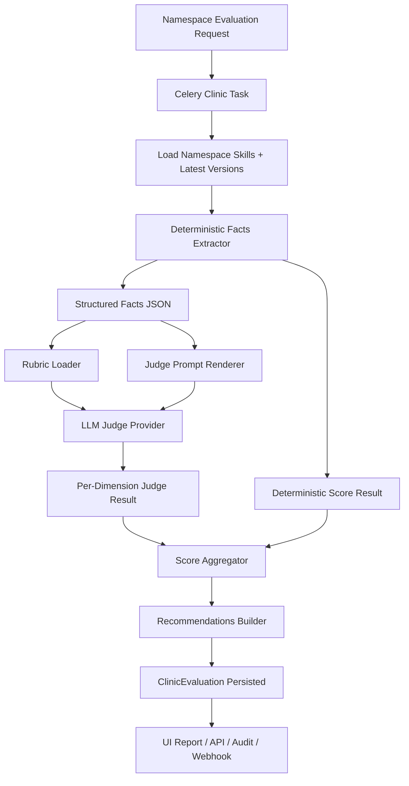

# Clinic 评测功能开发方案

本文档用于指导 DuckDock `Clinic` 评测能力从“启发式打分”演进为“静态事实检查 + LLM 评审 + 可回归校准”的正式质量评测流水线。

## 1. 当前现状

当前 `Clinic` 已经具备基本骨架：

- 触发入口：`POST /api/v1/clinic/namespaces/{ns}/evaluate`
- 历史列表：`GET /api/v1/clinic/namespaces/{ns}/evaluations`
- 详情查询：`GET /api/v1/clinic/evaluations/{id}`
- 异步任务：Celery `run_clinic_evaluation`
- 评测逻辑：`ClinicService.evaluate()`

关键代码位置：

- [`backend/app/api/v1/endpoints/clinic.py`](../backend/app/api/v1/endpoints/clinic.py)
- [`backend/app/workers/clinic_tasks.py`](../backend/app/workers/clinic_tasks.py)
- [`backend/app/services/clinic_service.py`](../backend/app/services/clinic_service.py)

当前评测维度共 8 个：

- `skill_completeness`
- `skill_quality`
- `skill_coherence`
- `security_health`
- `documentation`
- `version_currency`
- `style_consistency`
- `interaction_quality`

当前实现的问题：

- 评测规则大多直接写死在 Python 中，难以维护和调参
- LLM 评测逻辑仅对 Anthropic 做了可选增强，不利于接入现有百炼能力
- 分数由启发式规则和少量模型辅助混合得出，但缺少证据结构
- 缺少评测数据集、人工标注样例和回归基线
- 报告偏结果展示，缺少“为什么得分低”的可解释性

## 2. 产品目标

Clinic 的目标不是简单给 Namespace 打一个总分，而是提供一套可运营、可解释、可回归的 Skill 质量控制面。

应覆盖三类价值：

- 发布前质量判断：某个命名空间的技能集合是否达到可用标准
- 发布后治理追踪：版本质量是提升还是退化
- 团队改进建议：明确指出哪个 Skill、哪个维度、哪条证据有问题

Clinic v1 的产品目标：

- 对 Namespace 下全部 Skill 做统一评测
- 输出结构化维度分、证据、问题和建议
- 使用现有大模型做语义评审，但不让模型独占全部评分权
- 支持模型、Rubric、Prompt 的版本化
- 支持后续做回归比较和人工校准

## 3. 设计原则

### 3.1 混合评测

Clinic 不做“纯模型打分”，而是采用两层评测：

- 确定性检查层：负责收集客观事实
- LLM Judge 层：负责语义质量评审

### 3.2 资产化而不是硬编码

Rubric、Judge Prompt、评测样例不应该散落在 Python 逻辑里，而应资产化存储。

### 3.3 可解释优先

每个维度不仅要给 `score`，还必须输出：

- `issues`
- `evidence`
- `reasoning_summary`
- `suggestions`
- `confidence`

### 3.4 可回归

所有评测结果必须与以下版本绑定：

- `rubric_version`
- `judge_prompt_version`
- `model_name`
- `model_provider`

否则历史评测不具备可比性。

## 4. 总体架构



## 5. 评测对象与输入

评测对象仍然是“一个 Namespace 下的 Skill 集合”，但输入结构需要比现在更明确。

每个 Skill 建议整理为统一结构：

```json
{
  "name": "ppt-generator",
  "description": "Generate slide-ready web PPTs",
  "latest_version": "v1.2.0",
  "has_production": true,
  "version_count": 3,
  "last_updated": "2026-04-08T10:00:00Z",
  "skill_md": "...",
  "system_prompt": "...",
  "metadata": {
    "name": "ppt-generator",
    "version": "1.2.0",
    "description": "..."
  },
  "scan_result": {
    "status": "passed",
    "critical_count": 0,
    "high_count": 0,
    "medium_count": 1,
    "low_count": 2
  },
  "artifacts": {
    "examples_count": 2,
    "extra_files_count": 5
  }
}
```

## 6. 评测维度重构建议

保留现有 8 个维度，但按“静态优先”与“LLM 优先”重新分层。

### 6.1 静态优先维度

- `skill_completeness`
  - front matter 是否完整
  - 是否存在 `SKILL.md`
  - 是否存在 `system_prompt.md`
  - 是否有 production 版本
- `security_health`
  - scan 通过率
  - unresolved critical/high 数量
- `version_currency`
  - 最近更新时间
  - stale 版本比例
- `documentation`
  - 示例覆盖
  - usage/limitations 是否存在

### 6.2 LLM 优先维度

- `skill_quality`
  - 指令清晰度
  - 边界是否明确
  - 输入输出是否具体
- `interaction_quality`
  - 是否有良好的协作提示
  - 是否有错误处理与降级策略
- `style_consistency`
  - 表达风格是否统一
  - 指令结构是否稳定
- `skill_coherence`
  - Namespace 下多个 Skill 的定位是否冲突
  - 是否存在功能重叠或命名混乱

## 7. LLM Judge 设计

## 7.1 Provider 抽象

当前 `ClinicService` 直接写死 Anthropic 可选逻辑，这一层需要抽象成通用 Judge Provider。

建议接口：

```python
class ClinicJudgeProvider(Protocol):
    def evaluate_dimension(
        self,
        dimension: str,
        rubric: dict,
        namespace_context: dict,
        deterministic_facts: dict,
    ) -> dict: ...
```

首个 provider 建议直接接百炼 OpenAI-compatible 接口，模型默认使用：

- `qwen3.6-plus`

后续 provider 可扩展：

- OpenAI
- Anthropic
- 本地 vLLM / One API 兼容网关

### 7.2 输出格式

Judge 返回必须是严格 JSON，不能允许自由文本。

建议结构：

```json
{
  "dimension": "skill_quality",
  "score": 78,
  "confidence": 0.83,
  "issues": [
    "Several prompts are too generic about expected output format."
  ],
  "evidence": [
    {
      "skill": "ppt-generator",
      "snippet": "Create a presentation...",
      "reason": "Output constraints are underspecified."
    }
  ],
  "reasoning_summary": "Most skills are usable, but output constraints and examples are uneven.",
  "suggestions": [
    "Add explicit output schema or file expectations.",
    "Provide at least one realistic example per skill."
  ]
}
```

### 7.3 Prompt 模板

Judge Prompt 必须模板化，不能在服务代码里拼接长字符串。

建议目录：

```text
backend/app/clinic_assets/
  rubrics/
    skill_quality.v1.yaml
    interaction_quality.v1.yaml
  judge_prompts/
    dimension_judge.v1.md
    namespace_summary.v1.md
backend/tests/fixtures/
  clinic_golden_set.v1.jsonl
```

## 8. 确定性事实提取器

新增 `ClinicFactsExtractor`，先把客观事实提取出来，再交给 LLM。

建议输出内容：

- 文件完整性
- front matter 缺失项
- 示例数量
- 版本数
- production 版本比例
- 最近更新时间跨度
- scan 严重等级统计
- 是否存在重复或相似命名
- prompt 长度分布
- Markdown 标题结构分布

这样有三个好处：

- 降低模型幻觉
- 降低 Token 消耗
- 提高评测可解释性

## 9. 数据模型演进

当前 `ClinicEvaluation` 足够保存总结果，但不够支撑后续运营。

建议新增或扩展字段：

- `rubric_version`
- `judge_prompt_version`
- `model_provider`
- `model_name`
- `facts_snapshot`
- `judge_outputs`
- `namespace_snapshot`

建议后续可拆表：

### `clinic_evaluations`

- 评测任务主表
- 保存 overall score、grade、status、版本信息

### `clinic_dimension_results`

- 每个维度一行
- 保存 score、issues、evidence、confidence、suggestions

### `clinic_fixtures`

- 黄金样例集
- 用于回归校准

### `clinic_regressions`

- 保存两次评测之间的维度差值和告警状态

## 10. API 变更建议

### 10.1 保持现有 API

保留：

- `POST /clinic/namespaces/{ns}/evaluate`
- `GET /clinic/namespaces/{ns}/evaluations`
- `GET /clinic/evaluations/{id}`

### 10.2 建议新增

- `GET /clinic/evaluations/{id}/facts`
  - 查看静态事实快照
- `GET /clinic/evaluations/{id}/dimensions/{dimension}`
  - 查看单维度证据和建议
- `POST /clinic/namespaces/{ns}/evaluate?mode=quick|full`
  - `quick` 只跑静态层
  - `full` 跑静态层 + LLM judge
- `GET /clinic/rubrics`
  - 查看当前启用的 rubric 版本

## 11. 配置项建议

新增专用 Clinic 配置，不与 Skill 生成共用一套变量名。

建议：

- `CLINIC_LLM_PROVIDER`
- `CLINIC_LLM_BASE_URL`
- `CLINIC_LLM_API_KEY`
- `CLINIC_LLM_MODEL`
- `CLINIC_LLM_TIMEOUT_SECONDS`
- `CLINIC_EVAL_MAX_SKILLS`
- `CLINIC_EVAL_MODE`
- `CLINIC_RUBRIC_VERSION`
- `CLINIC_JUDGE_PROMPT_VERSION`

推荐默认值：

- `CLINIC_LLM_PROVIDER=openai_compatible`
- `CLINIC_LLM_MODEL=qwen3.6-plus`
- `CLINIC_EVAL_MODE=hybrid`

## 12. 前端报告页增强建议

当前 Clinic 页面已有基础展示，但后续建议增强以下信息：

- 维度卡片增加 `confidence`
- 增加“证据”折叠区
- 增加“与上次评测对比”
- 增加“本次扣分最多的 Skill”
- 增加“建议修复清单”
- 增加“模型版本 / Rubric 版本”显示

## 13. 开发阶段拆解

### Phase 1: Provider 抽象与配置收口

目标：

- 把 Anthropic 专用逻辑抽象掉
- 接入百炼 `qwen3.6-plus`
- 统一 JSON judge 输出

交付：

- `ClinicJudgeProvider`
- `OpenAICompatibleClinicJudge`
- 新配置项
- 最小可跑通的单维度 LLM 评测

### Phase 2: 静态事实层与 Rubric 资产化

目标：

- 从硬编码规则迁移到 Facts + Rubric
- 让评测可调参、可版本化

交付：

- `ClinicFactsExtractor`
- `clinic_assets/rubrics/*`
- `clinic_assets/judge_prompts/*`
- 新的聚合器

### Phase 3: 报告可解释性

目标：

- 让报告不只显示分数
- 能清楚说明问题出在哪里

交付：

- `evidence`
- `confidence`
- `reasoning_summary`
- 维度 drill-down API
- 前端报告增强

### Phase 4: 回归校准

目标：

- 评测变成“可验证的系统”，而不是一次性 prompt

交付：

- 黄金样例集
- 基线分数
- 回归测试脚本
- Prompt / 模型变更校准流程

### Phase 5: 差异评测与门禁

目标：

- 支持对比新旧版本质量变化
- 支持作为发布门禁输入

交付：

- regression diff
- threshold alerts
- 可选发布阻断条件

## 14. 推荐先行者项目

以下项目最值得参考，但不是要求直接深度集成。

### Promptfoo

适合借鉴：

- 测试集组织方式
- provider 抽象
- rubric / assertion 机制
- prompt 对比实验

官方文档：

- https://www.promptfoo.dev/docs/getting-started/
- https://www.promptfoo.dev/docs/configuration/guide/
- https://www.promptfoo.dev/docs/usage/self-hosting/

### OpenAI Graders

适合借鉴：

- “grader 也是可配置对象”的设计
- 评分与规则分离
- model grader 与 python grader 混合使用

官方文档：

- https://developers.openai.com/api/docs/guides/graders

### Langfuse

适合借鉴：

- datasets
- experiments
- scores
- traces 和评测关联

官方文档：

- https://langfuse.com/docs
- https://langfuse.com/docs/evaluation/overview
- https://langfuse.com/docs/evaluation/evaluation-methods/llm-as-a-judge

### DeepEval

适合借鉴：

- metric 设计方式
- Python 化评测组织
- CI 集成思路

官方文档：

- https://www.confident-ai.com/docs/setup-and-installation
- https://deepeval.com/

### Ragas

适合借鉴：

- 后续如果扩展到 RAG / 检索型 skill 评测，可参考其指标设计

官方文档：

- https://docs.ragas.io/en/v0.3.5/references/metrics/

## 15. 结论

Clinic 的正确方向不是“再往当前启发式逻辑里多塞几条规则”，也不是“完全交给一个大模型打分”。

更合理的路线是：

- 静态事实层负责客观性
- LLM Judge 层负责语义质量
- Rubric / Prompt / Fixture 负责版本化与回归

如果按落地优先级执行，建议顺序如下：

1. Provider 抽象并接入百炼 `qwen3.6-plus`
2. 抽出 Facts + Rubric 资产层
3. 补全报告证据和建议结构
4. 建立黄金样例集与回归流程
5. 最后再接发布门禁
