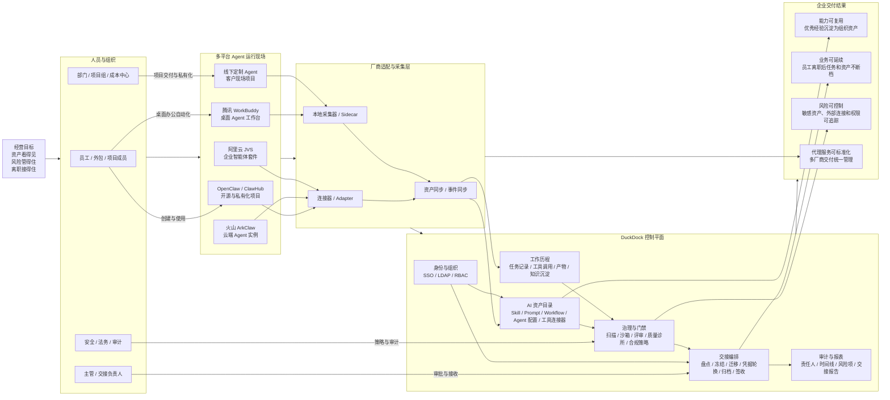

# DuckDock 企业 AI Agent 资产与交接控制平面业务架构图

> 汇报口径：DuckDock 不只是 Skill 仓库，而是企业统一管理 AI Agent 资产、运行现场、工作成果和离职交接的控制平面。

## 老板视角说明

这张图表达的是一个业务闭环：

1. 企业里不同员工和团队会在 OpenClaw、ArkClaw、WorkBuddy、JVS、线下定制项目里创建和使用 AI Agent 能力。
2. DuckDock 通过适配器和采集器把这些平台里的资产、工作记录和产物统一纳管。
3. 控制平面负责身份权限、资产目录、工作历程、质量安全、交接编排和审计报表。
4. 当员工离职或项目交接时，系统能自动盘点资产、冻结风险入口、迁移责任人、轮换凭据、归档工作成果并形成交接报告。
5. 最终价值不是“存 Skill”，而是让企业 AI 能力成为可管理、可复用、可交接、可审计的组织资产。

## 一句话定位

DuckDock 是企业 AI Agent 资产与交接控制平面，帮助代理服务商把多厂商、多项目、多员工沉淀下来的 AI 能力统一管理起来，并在人员流动时保证业务不断档、资产不丢失、风险可追踪。
